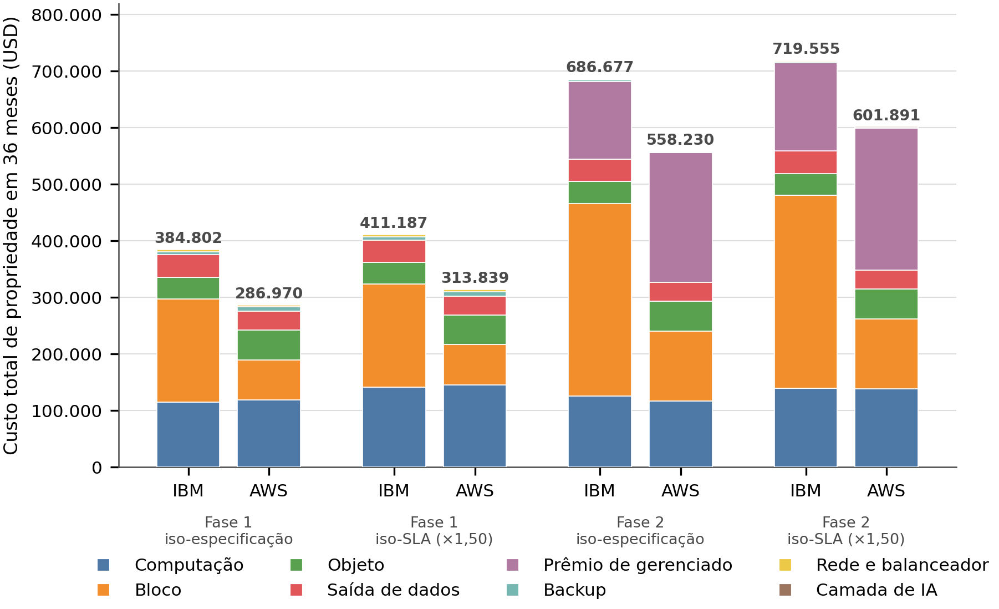

<div align="center">

# Block storage decides the bill

**Two public clouds, one migration, 36 months: the block-storage line alone is USD 110,506.59 apart — more than the entire gap between the two providers.**

[](https://doi.org/10.5281/zenodo.21955051)
[](LICENSES/Apache-2.0.txt)
[](LICENSES/CC-BY-4.0.txt)
[](pyproject.toml)
[](tests/)
[](PROVENANCE.md)

</div>

> [!IMPORTANT]
> **Finding.** For a twelve-server migration priced in São Paulo on 13 August 2026, AWS is cheaper
> than IBM Cloud by **USD 97,832.15 over 36 months** in phase 1 (34.1%) and **USD 80,313.86** in phase 2
> (23.0%). The item that produces the gap is **block storage** — USD 181,525 against USD 71,019, a
> difference of **USD 110,506.59**, larger than the total gap. Compute, the line everyone compares,
> runs the other way: IBM Cloud is **USD 3,348 cheaper** over the same horizon. The verdict does not
> flip anywhere in the pre-registered sizing grid: 24 of 24 points favour the same provider.

This repository is the **evidence and computation** behind a case study on migrating an on-premises
estate to public cloud. It contains the raw price bodies captured from the providers' public
endpoints, the code that captured them, the deterministic cost and queueing models built on top,
the tests that lock every published number, and a cryptographic bridge back to the sealed
provenance chain of the study.

The **text of the article is deliberately not here** — scope and rationale in
[`docs/adr/ADR-001-scope-and-divergences.md`](docs/adr/ADR-001-scope-and-divergences.md).

## What this contributes

1. **Prices that can be audited, not quoted.** 46 raw JSON bodies from the IBM Cloud Global Catalog
   and the AWS Price List, plus 4 saved HTML pages, all captured on 2026-08-13 with the request path
   recorded. Every unit price used by the model carries the file it came from
   ([`output/tabelas/precos-unitarios.csv`](output/tabelas/precos-unitarios.csv)).
2. **A cost verdict that cannot be tuned after the fact.** The sizing grid, the demand vector, the
   commercial-parity matrix and the break condition were sealed **before** any price existed —
   [`PREREGISTRATION.md`](PREREGISTRATION.md) — and the chain proves the ordering.
3. **A reproducible pipeline, verified end to end.** `python3 run_all.py` rebuilds every CSV and
   every figure from the frozen bodies and then verifies the checksums; on the reference machine the
   regenerated artefacts are **byte-identical** to the published ones.

## At a glance

| | |
|---|---|
| Capture date | 2026-08-13 (single day, both providers) |
| Regions | IBM Cloud `br-sao` · AWS `sa-east-1` |
| Currency / billing country | USD / `USA` on both sides (locked before capture) |
| Horizon | 36 months, 730 hours per month |
| Evidence | 46 JSON bodies + 4 HTML pages, hashes sealed |
| Model | stdlib only; `matplotlib` only to redraw figures |
| Tests | 61 |

## Quick start

```bash
git clone https://github.com/ulissesflores/block-storage-tco.git
cd block-storage-tco
python3 run_all.py                 # stdlib only
python3 run_all.py --figures       # also redraws the figures (pip install matplotlib)
```

Expected tail of the output:

```text
=== tests ===
Ran 61 tests in 1.4s

OK

=== integrity (fresh checksums + bridge to the sealed chain) ===
[OK] 121 files verified
[OK] tree_hash <recomputed over this tree; the value is recorded in provenance.json>
[OK] sealed stage 'environment' recomputes to e116b39d689216d7ee6b936adc6133dd8532071fa07ce16c39fa2c379b1e543d
[OK] sealed stage 'data' recomputes to d1221100a76ce4e0bdd90dedd20e029d063a3b46d7a31f9bb706b63173d5ca95

[OK] every result regenerated, every test green, integrity verified
```

Without `matplotlib` installed, Track 1 still passes and reports `OK (skipped=3)`: the three
figure-geometry cases are the only ones that need it.

The last two lines are the ones that matter: they are stage hashes of the study's **sealed
provenance chain**, recomputed here from the published files. See [`PROVENANCE.md`](PROVENANCE.md).

## Results

36-month total cost of ownership, sized to the specification of the twelve servers
([`output/tabelas/tco-resumo.csv`](output/tabelas/tco-resumo.csv)):

| Phase | IBM Cloud (USD) | AWS (USD) | Gap (USD) | Gap (%) | Lower |
|---|---:|---:|---:|---:|---|
| 1 — lift-and-shift | 384,802.19 | 286,970.04 | 97,832.15 | 34.1% | AWS |
| 2 — modernisation | 429,733.13 | 349,419.27 | 80,313.86 | 23.0% | AWS |

Where the gap comes from, phase 1 ([`output/tabelas/tco-por-item.csv`](output/tabelas/tco-por-item.csv)):

| Cost item | IBM Cloud (USD) | AWS (USD) | Difference (USD) |
|---|---:|---:|---:|
| Block storage | 181,525.31 | 71,018.72 | **+110,506.59** |
| Compute | 115,526.88 | 118,874.95 | −3,348.07 |
| Object storage | 38,432.38 | 52,483.60 | −14,051.22 |
| Data transfer out | 39,912.54 | 33,177.60 | +6,734.94 |
| Backup | 5,761.07 | 7,867.37 | −2,106.30 |
| Network, IP and load balancer | 3,644.01 | 3,547.80 | +96.21 |



Two sizing methods were compared: **iso-specification** (match the vCPU and RAM of each existing
server) and **iso-SLA** (add headroom until the 95th percentile of response time fits the 200 ms
requirement). The queueing model derives the operating point instead of assuming it: ×1.50 is the
smallest multiplier in the pre-registered grid whose p95 (166.26 ms) fits the target
([`output/tabelas/filas-ponto-iso-sla.csv`](output/tabelas/filas-ponto-iso-sla.csv)). Across the
whole grid the ranking never changes, but the size of the gap does — which is the point the study
set out to measure.

## What is and isn't claimed

**Claimed.** The prices are real, public and captured on 2026-08-13 from the endpoints recorded in
`data/precos/MANIFEST.md`. The arithmetic on top of them is deterministic and re-runnable. The
verdict — AWS cheaper in both phases — holds at every point of the pre-registered grid.

**Not claimed.** The workload is **synthetic**: the arrival rate, service time and coefficients of
variation are declared assumptions about a fictional company, not telemetry. Nothing here measures
performance of either provider. A G/G/1 model per instance overstates waiting time against a pool
sharing one queue; the same model is applied to both sides, so the comparison stands but the caveat
is stated rather than left to be found. Availability statements are graduated: IBM's AI layer was
**not declared for `br-sao` in the catalogue node consulted on 2026-08-13** — that is not a claim
that it does not exist.

**Frozen.** The IBM Cloud `/pricing` responses are **not versioned by date**, so a capture made today
would return different numbers and could not be compared byte for byte. The 2026-08-13 bodies are
frozen evidence: their hashes are sealed, and `run_all.py` never overwrites them. The capture code is
published so the path can be audited and re-run against today's catalogue — into a different
directory, deliberately.

## Integrity

Two independent seals, described in full in [`PROVENANCE.md`](PROVENANCE.md):

```bash
python3 make_provenance.py --verify      # this tree matches its own checksums
sha256sum -c checksums.sha256            # or the plain-text digest list
```

The same command recomputes **two stages of the study's sealed chain** from the files published
here — the frozen environment and the captured price bodies — and compares them with the values
folded into ROOT `d364fabf…`. A single changed byte in `data/` breaks the match.

## Layout

```text
run_all.py             single entry point: rebuild -> test -> verify
make_provenance.py     fresh checksums + bridge to the sealed chain
src/                   capture (IBM, AWS), catalogue, cost model, queueing model, figures
configs/               case, load assumptions, technical design, amendments, chain stages
data/precos/api/       43 raw JSON bodies (versioned API path)
data/precos/manual/    3 price tables extracted from public pages
data/evidencia/        4 raw HTML pages, hashed, kept as evidence of what was served
output/tabelas/        16 CSV files, all regenerated by the published code
output/figuras/        5 figures, redrawn deterministically
tests/                 61 tests: published numbers, laws, determinism, integrity
```

## Author

**Carlos Ulisses Flores**
[](https://orcid.org/0000-0002-6034-7765)
[](https://ulissesflores.com)
[](http://lattes.cnpq.br/6905246706890561)

## Citation

```bibtex
@software{flores_block_storage_tco,
  author    = {Flores, Carlos Ulisses},
  title     = {Block storage decides the bill: audited public-cloud price capture
               and a deterministic 36-month TCO model},
  year      = {2026},
  version   = {1.5.0},
  doi       = {10.5281/zenodo.21955051},
  publisher = {Zenodo},
  url       = {https://doi.org/10.5281/zenodo.21955051}
}
```

The DOI above is the **concept DOI**: it always resolves to the latest version. To pin the exact
contents you read, cite the version DOI of that release instead — it is listed on the Zenodo record.
Machine-readable metadata: [`CITATION.cff`](CITATION.cff) and [`codemeta.json`](codemeta.json).

> **Why the tag and `main` differ by one commit.** Zenodo mints a version DOI *from* the GitHub
> release, so the tagged tree cannot contain its own version DOI — it does not exist yet when the
> tag is cut. Each release is therefore followed by a single backfill commit on `main` that records
> the freshly minted identifier in `CITATION.cff`. The difference is expected and touches metadata
> only: no result, evidence or hash changes.

## License

Code under [Apache-2.0](LICENSES/Apache-2.0.txt); data, figures and documentation under
[CC BY 4.0](LICENSES/CC-BY-4.0.txt). See [`NOTICE`](NOTICE) for the provider terms that apply to
the captured price bodies.

## References

- IBM Cloud Global Catalog API — <https://globalcatalog.cloud.ibm.com/api/v1>
- AWS Price List Bulk API — <https://pricing.us-east-1.amazonaws.com/offers/v1.0/aws/index.json>
- Kingman, J. F. C. (1961). The single server queue in heavy traffic. *Mathematical Proceedings of
  the Cambridge Philosophical Society*, 57(4), 902–904. <https://doi.org/10.1017/S0305004100036094>
- Kingman, J. F. C. (1962). On queues in heavy traffic. *Journal of the Royal Statistical Society:
  Series B*, 24(2), 383–392. <https://doi.org/10.1111/j.2517-6161.1962.tb00465.x>
- Laurie, B., Langley, A., & Kasper, E. (2013). *Certificate Transparency* (RFC 6962).
  <https://doi.org/10.17487/RFC6962>
- Haber, S., & Stornetta, W. S. (1991). How to time-stamp a digital document. *Journal of
  Cryptology*, 3(2), 99–111. <https://doi.org/10.1007/BF00196791>
